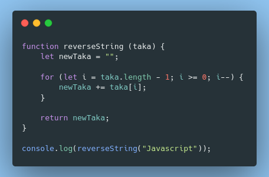

# Algorithms!

## Case #1

> Inputkan sebuah String, kemudian urutkan terbalik String tersebut. Outputkan hasilnya!
> Contoh:
> Input: JavaScript
> Output: tpircSavaJ

**The algorithm** :

1. Start
2. Create function **reverseString** with parameter **taka**
3. Declare variable **newTaka** with empty string
4. Create for loop with **i = taka.length - 1**, **i >= 0**, **and i-- .**
5. Assign **newTaka += taka[i]** inside loop
6. Return **newTaka**
7. Print function with String argument
8. End

**Snippets:**

## Case #2

> Diberikan sebuah teks, periksa apakah kata tersebut palidrom atau tidak. Misalnya teks "Malam", output = Palindrom.

**The algorithm** :

1. Start
2. Create function **palindromeDetector** with parameter **palindrome**
3. Declare variable **newPal** with empty string
4. Create FOR loop with **i = palindrome.length - 1**, **i >= 0**, **and i-- .**
5. Assign **newPal += palindrome[i]** inside loop
6. IF **newPal === palindrome** is TRUE, Return **"Palindrome"**
7. ELSE Return **"It's Not Palindrome"**
8. Print function with String argument
9. End

## Case #3

> Diberikan sebuah kalimat, ubah urutan kata-kata di dalam kalimat menjadi terbalik. Misalnya kalimat "Saya belajar Javascript", output = "Javascript belajar Saya"

**The algorithm** :

1. Start
2. Create function **reverseWordPosition** with parameter **phrase**
3. Return **phrase.split(" ").reverse().join(" ");**
4. Print function with String argument
5. End

## Case #4

> Diberikan sebuah kata Surabaya, ubah huruf "a" pada kata tersebut menjadi huruf "o". Sehingga output-nya menjadi Suroboyo.

**The algorithm** :

1. Start
2. Create function **changeLetter** with parameter **char**
3. Return **char.replace(/a/g, "o");**
4. Print function with String argument
5. End
