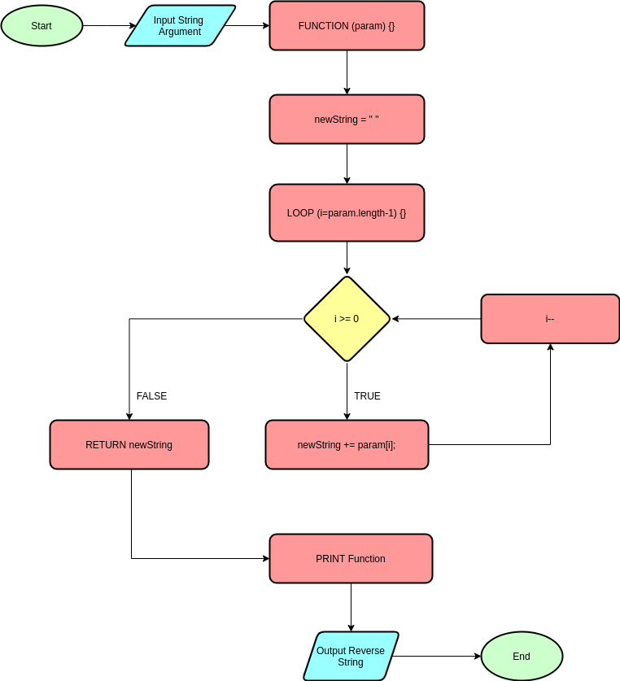
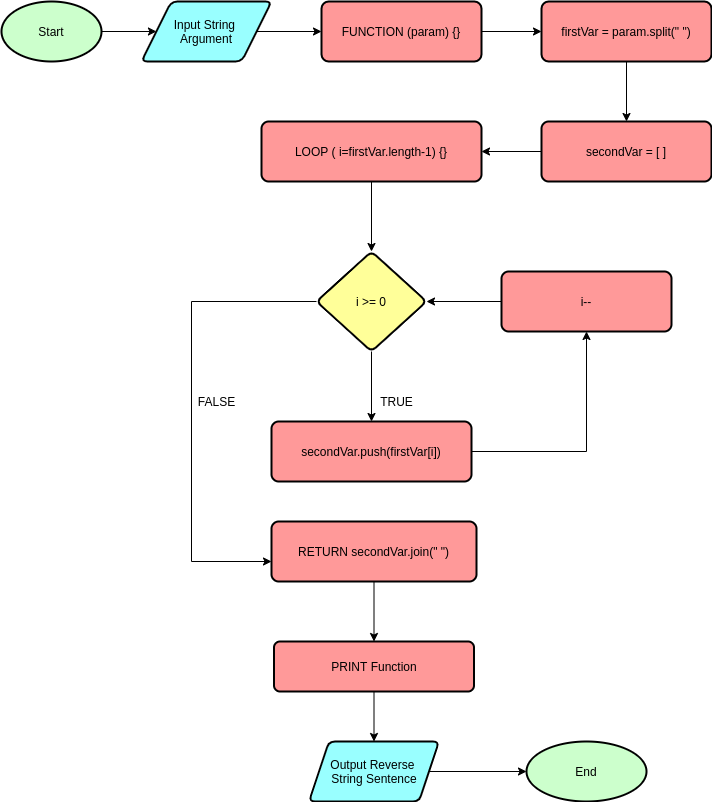

# Flowcharts!

## Case #1

> Inputkan sebuah String, kemudian urutkan terbalik String tersebut. Outputkan hasilnya!
> Contoh:
> Input: JavaScript
> Output: tpircSavaJ

**The Flowchart** : \

## Case #2

> Diberikan sebuah teks, periksa apakah kata tersebut palidrom atau tidak. Misalnya teks "Malam", output = Palindrom.

**The Flowchart** :

## Case #3

> Diberikan sebuah kalimat, ubah urutan kata-kata di dalam kalimat menjadi terbalik. Misalnya kalimat "Saya belajar Javascript", output = "Javascript belajar Saya"

**The Flowchart** :

## Case #4

> Diberikan sebuah kata Surabaya, ubah huruf "a" pada kata tersebut menjadi huruf "o". Sehingga output-nya menjadi Suroboyo.

**The Flowchart** :

